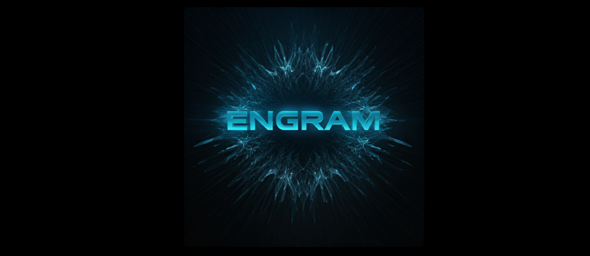

<p align="center">
  
</p>

# Engram

An engram is a unit of cognitive information imprinted in the mind palace. It is a memory trace that represents a specific experience, event, or piece of information.

> You never forget anything, you just have to find the right engram.

Engram is the server-side metadata extraction layer for the mind palace archival system. Files arrive via canonical storage events, metadata is extracted in the background, and a read-only API provides search and query access to the indexed metadata.

## How It Works

```
Path 1 (filesystem):  Go watcher (fsnotify) → RabbitMQ → Python worker → PostgreSQL
Path 2 (S3):          Storage backend → RabbitMQ → Python worker → PostgreSQL

API:                  PostgreSQL ← read-only queries ← clients
```

1. A file appears in storage (written to a watched directory, or uploaded to an S3 bucket)
2. An event is published to RabbitMQ by the Go watcher or the backend that performed the S3 operation
3. The Python ingestion worker picks up the event, reads the file, extracts metadata (MIME type, text content, page count), generates tags, and writes everything to PostgreSQL
4. The API serves read-only queries against the indexed metadata — search by filename, filter by tags or device

## Stack

- **Go** — Backend API server (read-only metadata queries) and filesystem watcher (separate binary)
- **Python** — Ingestion worker for metadata extraction
- **PostgreSQL** — Metadata database (unix socket, no TCP)
- **RabbitMQ** — Event queue between storage events and worker
- **MinIO** — S3-compatible object storage for development
- **Nix flakes** — Development environment and service orchestration

## Prerequisites

- [Nix](https://nixos.org/download/) with flakes enabled

That's it. Nix provides Go, Python, PostgreSQL, RabbitMQ, and all other tools.

## Setup

```bash
git clone <repo-url> && cd engram
nix develop    # Enter the development shell
```

## Development

### Quick Start (recommended)

```bash
bin/dev
```

This launches a tmux session with four windows:
- **infra** — PostgreSQL + RabbitMQ + MinIO (via process-compose)
- **backend** — Go API with hot reload (air)
- **ingestion** — Python worker (uv run)
- **watcher** — Go filesystem watcher (watches `.data/watch/`)

Switch between windows with `Ctrl+b 0/1/2/3`. Detach with `Ctrl+b d`.

To test the filesystem path, drop a file into `.data/watch/`:

```bash
cp some-file.pdf .data/watch/
curl http://localhost:8080/api/files?status=ready
```

To test the S3 path, upload to MinIO:

```bash
source bin/load-infra-env
mc alias set local $STORAGE_S3_ENDPOINT minioadmin minioadmin
mc cp some-file.pdf local/engram/
```

### Manual Setup

If you prefer separate terminals:

```bash
# Terminal 1: Start infrastructure
bin/start-infra

# Terminal 2: Start Go backend
source bin/load-infra-env
cd backend && air

# Terminal 3: Start ingestion worker
source bin/load-infra-env
cd ingestion && uv run main.py

# Terminal 4: Start filesystem watcher
source bin/load-infra-env
cd watcher && WATCH_DIRS=.data/watch go run .
```

### Shell Commands

| Command | Description |
|---------|-------------|
| `bin/dev` | Launch full dev environment in tmux |
| `bin/start-infra` | Start PostgreSQL + RabbitMQ + MinIO |
| `bin/shutdown-infra` | Stop infrastructure services |
| `source bin/load-infra-env` | Export `PGHOST`, `RABBITMQ_AMQP_PORT` into current shell |
| `bin/start-backend` | Start Go API in a tmux window |
| `bin/start-ingestion` | Start Python worker in a tmux window |
| `bin/start-watcher` | Start filesystem watcher in a tmux window |
| `bin/test-ingest` | Run end-to-end integration test |

### Dev Shells

```bash
nix develop              # Full shell (Go + Python + infra)
nix develop .#backend    # Go backend only
nix develop .#watcher    # Go watcher (same as backend)
nix develop .#ingestion  # Python worker only
nix develop .#infra      # Infrastructure tools only
```

### Building

```bash
# Go backend
cd backend && go build -o engram-backend

# Go watcher
cd watcher && go build -o engram-watcher

# Python worker (dependencies managed by uv)
cd ingestion && uv sync
```

### Packaged Image Outputs

Engram owns the package and container outputs for its deployable runtime
boundaries. Mind Palace root orchestration consumes these outputs and may tag
the loaded images to platform names such as `mind-palace-engram-api:latest`.

| Output | Image | Purpose |
|--------|-------|---------|
| `backend` | — | Go read-only metadata API package |
| `api-container` | `engram-api:latest` | Go API image exposing port `8081` |
| `ingestion` | — | Packaged Python ingestion runtime |
| `ingestion-container` | `engram-ingestion:latest` | Python metadata ingestion worker image |

Build the images from this repository:

```bash
nix build .#api-container --no-link --print-out-paths
nix build .#ingestion-container --no-link --print-out-paths
```

The API image runs the Engram backend binary, exposes `8081/tcp`, and includes
`engram-api-healthcheck`, which probes `http://127.0.0.1:8081/api/health`.
The API accepts `PORT`, `PGHOST`, `PGUSER`, `PGPASSWORD`, `PGDATABASE`,
`AUTH_MODE`, `OIDC_ISSUER_URL`, `OIDC_CLIENT_ID`, `OIDC_USERNAME_CLAIM`,
`OIDC_REDIRECT_URI`, and `PRESIGN_URL_TEMPLATE` from the runtime environment.

The ingestion image runs the packaged Python worker without installing
dependencies during Compose startup. It includes CA certificates plus extraction
tools used by the worker, including `file`, `ffmpeg`, `poppler-utils`, and
`tesseract`. It accepts `PGHOST`, `PGUSER`, `PGPASSWORD`, `PGDATABASE`,
`RABBITMQ_HOST`, `RABBITMQ_AMQP_PORT`, `STORAGE_BACKEND`,
`STORAGE_S3_ENDPOINT`, `STORAGE_S3_ACCESS_KEY`, `STORAGE_S3_SECRET_KEY`, and
`STORAGE_S3_BUCKET` from the runtime environment. The ingestion image includes
`engram-ingestion-healthcheck`, a PID liveness check for Compose.

### Adding Dependencies

```bash
# Go (backend or watcher)
cd backend && go get <package>
cd watcher && go get <package>

# Python
cd ingestion && uv add <package>
```

### Resetting State

All runtime data (database, queues, watched files, MinIO storage) lives in `.data/`. To start fresh:

```bash
rm -rf .data/
```

### Querying the Database

```bash
source bin/load-infra-env
psql -h $PGHOST engram
```

## API

The backend API is read-only — it queries metadata from PostgreSQL. No file upload or download.

| Method | Endpoint | Description |
|--------|----------|-------------|
| `GET` | `/api/health` | Health check |
| `GET` | `/api/files` | List/search files (`?q=`, `?tag=`, `?device=`, `?status=`) |
| `GET` | `/api/files/{id}` | Get file detail with extracted metadata and tags |
| `GET` | `/api/tags` | List all tags with file counts |
| `GET` | `/api/devices` | List all devices |

## Configuration

### Backend API

| Variable | Default | Description |
|----------|---------|-------------|
| `PORT` | `8080` | API server port |
| `PGHOST` | — | PostgreSQL unix socket directory |
| `PGUSER` | `postgres` | PostgreSQL user |
| `PGPASSWORD` | — | PostgreSQL password, required for TCP deployments |
| `PGDATABASE` | `engram` | PostgreSQL database name |
| `AUTH_MODE` | — | `oidc` to require bearer tokens, `none` or empty for unauthenticated local access |
| `OIDC_ISSUER_URL` | — | OIDC issuer used for token validation and browser discovery helpers |
| `OIDC_CLIENT_ID` | `mind-palace` | Public OIDC client id advertised to clients |
| `OIDC_USERNAME_CLAIM` | `preferred_username` | Userinfo claim used as the owner identity |
| `OIDC_REDIRECT_URI` | `com.mindpalace.app://callback` | Redirect URI advertised by `/api/auth/config` |

### Auth Helper API

When browser clients need to sign in, Engram exposes the same public helper
shape used by Reliquary:

| Method | Endpoint | Description |
|--------|----------|-------------|
| `GET` | `/api/auth/config` | Returns enabled auth modes and OIDC client metadata without secrets |
| `GET` | `/api/auth/oidc/discovery` | Proxies the configured provider discovery document |
| `POST` | `/api/auth/oidc/token` | Proxies authorization-code and refresh-token exchanges to the provider |

The OIDC discovery and token routes return a clear non-2xx response when
`AUTH_MODE` is not `oidc` or the issuer is missing.

### Filesystem Watcher

| Variable | Default | Description |
|----------|---------|-------------|
| `WATCH_DIRS` | — | Comma-separated directories to watch |
| `DEVICE_NAME` | hostname | Device identifier |
| `RABBITMQ_AMQP_PORT` | `5672` | RabbitMQ AMQP port |
| `WATCH_IGNORE` | — | Extra comma-separated ignore patterns (added to defaults) |

Default ignore patterns: `.git`, `.DS_Store`, `node_modules`, `__pycache__`, `.venv`, `.data`, `tmp`, and all dotfiles.

### Ingestion Worker

| Variable | Default | Description |
|----------|---------|-------------|
| `PGHOST` | — | PostgreSQL unix socket directory |
| `PGUSER` | `postgres` | PostgreSQL user |
| `PGPASSWORD` | — | PostgreSQL password, required for TCP deployments |
| `PGDATABASE` | `engram` | PostgreSQL database name |
| `RABBITMQ_HOST` | `127.0.0.1` | RabbitMQ host |
| `RABBITMQ_AMQP_PORT` | `5672` | RabbitMQ AMQP port |
| `STORAGE_S3_ENDPOINT` | — | S3 endpoint (only for S3 storage type) |
| `STORAGE_S3_ACCESS_KEY` | — | S3 access key |
| `STORAGE_S3_SECRET_KEY` | — | S3 secret key |
| `STORAGE_S3_BUCKET` | `engram` | S3 bucket name |

In development, `PGHOST`, `RABBITMQ_AMQP_PORT`, and S3 vars are set automatically by the Nix shell and `bin/load-infra-env`.
